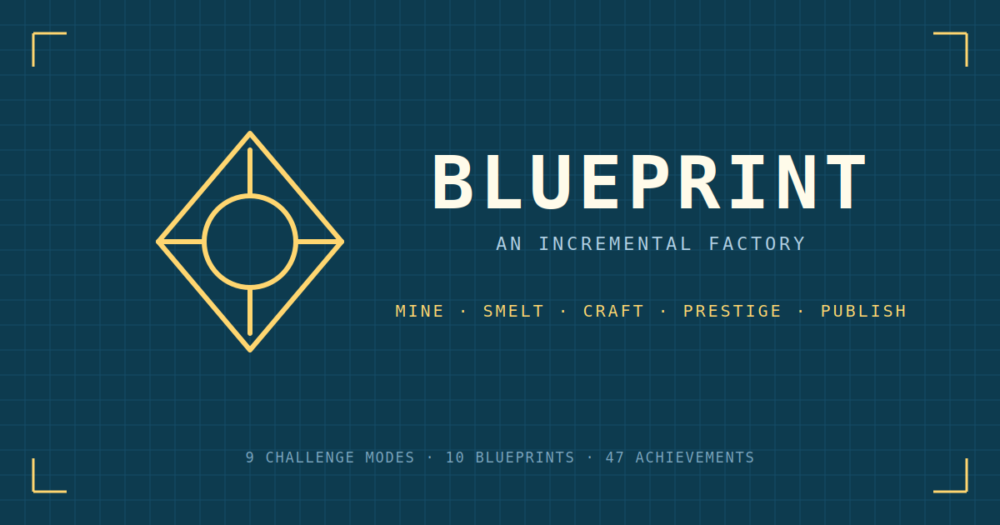

<p align="center">
  
</p>

<h1 align="center">Blueprint</h1>

<p align="center">
  <em>An engineering-sheet incremental. Build a factory one machine at a time, prestige for Schematics, publish for Patents.</em>
</p>

<p align="center">
  <a href="https://westicles.itch.io/blueprint-an-incremental-factory"></a>
  &nbsp;
  <a href="https://real-fruit-snacks.github.io/blueprint/"></a>
  &nbsp;
  <a href="LICENSE"></a>
  &nbsp;
  
  &nbsp;
  
</p>

---

Blueprint is a browser incremental drawn as an engineering schematic. Mine ore, smelt ingots, press parts, assemble circuits, forge cores, and refine prototypes across six tiers. When a run matures, **prestige** to bank Schematics and unlock the radial research tree. Push deeper to unlock the meta layer — **publish** for Patents that persist across every reset.

No framework, no build step, no external assets. Every machine icon, research node, UI glyph, and sound is generated at runtime from SVG primitives and the Web Audio API.

## Screenshots

<table>
<tr>
<td width="50%"><br><sub><b>Factory.</b> Six production tiers on a drafting sheet. Flow connectors show what feeds what; bottleneck cues flag starved machines.</sub></td>
<td width="50%"><br><sub><b>Research.</b> Parallel tracks across six branches — Tier Unlocks, Speed, Logistics, Yield, Automation, Efficiency, Power. Each node has 5–10 levels.</sub></td>
</tr>
<tr>
<td width="50%"><br><sub><b>Mastery.</b> The meta layer. Publish for Patents, attempt any of nine challenge modes for permanent rewards.</sub></td>
<td width="50%"><br><sub><b>Stats.</b> Live charts of resources, production rate, schematics, and patents on a rolling 1-hour window.</sub></td>
</tr>
<tr>
<td colspan="2"><br><sub><b>Achievements.</b> 59 earnables across five groups. Every card carries a progress bar, most carry a stacking bonus.</sub></td>
</tr>
</table>

## Features

### Production
- **6 tiers** — Ore → Ingot → Part → Circuit → Core → Prototype
- **28 machines** with three rarity rungs per tier (base / MK-IV / MK-V)
- **2 support structures** — Power Node, Boost Relay — multiply global output
- **Bottleneck feedback** when any upstream tier starves its consumers
- **Offline progression** capped at 8 hours (extendable via patents)

### Progression
- **60+ research nodes** on a radial tree across six discipline branches
- **Twin prestige layers** — Schematics (per-run) and Patents (meta, survives every reset)
- **21 patents** in the Mastery library with stacking leveled upgrades
- **9 challenge modes** with constraint-driven runs and permanent rewards
- **10 blueprints** — random per-run modifiers rolled after every prestige for run-to-run variance
- **59 achievements** with progress bars and stacking passive bonuses

### Interaction
- **Per-resource manual crafting** — click any tier to progress a click-bar; each click consumes the previous tier's input
- **Per-resource auto-mine toggles** (unlocked via research + the Omnitap patent)
- **Buy modes** — ×1, ×10, ×100, ×1000, MAX — gated by research
- **Procedural audio** via the Web Audio API — every event has its own voice, no samples

### Quality of life
- **One-tap save export** to clipboard, plus base64 import for backup or cross-device transfer
- **Last-backup pill** in settings shows how fresh your export is
- **Backup reminder toast** after prestige if you haven't exported in a while
- **Settings** — volume, notation (K/M/B vs scientific), tip popups, reset hints
- **Stats** — lifetime totals, run projections, prestige history, machine counts

### Accessibility
- **Reduce motion** — auto (OS preference) / on / off. Disables celebration flashes, screen shake, and particle effects
- **Colorblind-safe palette** — swaps the six branch hues for an IBM-derived palette with ≥25° hue and ≥20% brightness separation
- **Configurable difficulty** via challenge modes
- **Touch-first mobile layout** — pinch-zoom and drag the research tree, long-press machines for detail, scrollable modals that don't clip under browser chrome

### PWA
- **Installable** from the browser on desktop and mobile
- **Offline play** — service worker caches the entire shell and runs without a connection after first load
- **Standalone window** with the blueprint accent as theme color

## Controls

### Desktop

| Action | Binding |
| :--- | :--- |
| Buy one machine | Click |
| Buy ×10 / ×100 / ×1000 | Shift · Shift+Alt · Ctrl+Shift + Click *(requires Bulk Buy / Max Buy research)* |
| Toggle auto-buy per machine | Right-click *(requires Auto-Buy research)* |
| Pan the research tree | Click + drag |
| Zoom the research tree | Scroll wheel — or the ⊕ / ⊖ buttons |

### Touch

| Action | Gesture |
| :--- | :--- |
| Buy one machine | Tap |
| Machine details | Long-press |
| Toggle auto-buy | Tap the small **A** chip on the machine card |
| Bulk buy | Use the **BUY MODE** bar above the factory |
| Pan / zoom the tree | Drag / pinch |
| Arm and confirm a research node | Tap to arm · tap again to confirm |

All desktop modifier shortcuts have on-screen equivalents — the **BUY MODE** bar and the **A** chip — so the game plays with clicks alone if you prefer.

## Play

- ▶ **[Play on itch.io](https://westicles.itch.io/blueprint-an-incremental-factory)** — official release page with comments and updates.
- ▶ **[Play on GitHub Pages](https://real-fruit-snacks.github.io/blueprint/)** — always the latest commit, plus installable as a PWA with offline play (the itch embed can't register a service worker).
- On iOS and Android you can also **Add to Home Screen** from the GitHub Pages build for an offline-capable standalone app.

### Run locally

No install, no build step, no server required. Open `index.html` in any modern browser:

```bash
git clone https://github.com/Real-Fruit-Snacks/blueprint.git
cd blueprint
# open index.html — or serve with any static host
python -m http.server 8000   # optional: http://localhost:8000
```

The service worker only registers over `http://` or `https://`, so `file://` opens work but won't cache for offline use.

## Tech

- **Pure vanilla** HTML / CSS / JavaScript. No framework.
- **Zero runtime dependencies.** No `package.json`, no `node_modules`. The `.itch/` folder has publishing tools; nothing in the shipped game imports from it.
- **Single-file deploy** — every asset in the repo root ships as-is to any static host.
- **Web Audio API** for all sound effects, synthesized on demand.
- **LocalStorage** for saves (base64-encodable for export).
- **Service worker** (`sw.js`) precaches the shell; cache-first with background refresh.
- **SVG + CSS** for every visual element, including the drafting grid, tier pips, flow connectors, and schematic corner ticks.

## Browser support

Tested on current Chrome, Firefox, Edge, and Safari (desktop + mobile). The game is responsive down to ~360 px and handles viewport chrome changes on iOS Safari.

## License

[MIT](LICENSE)
